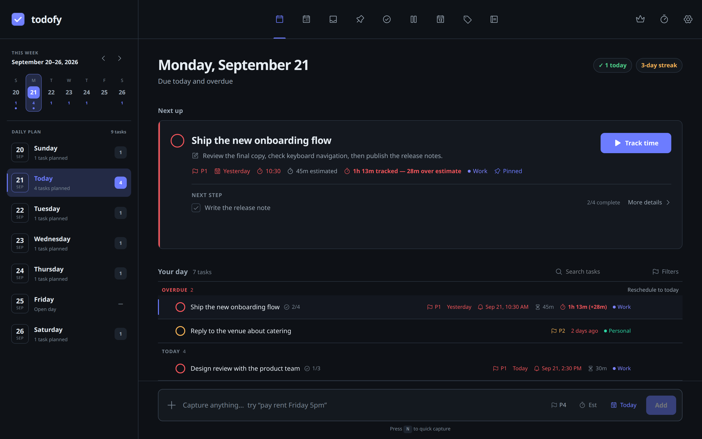
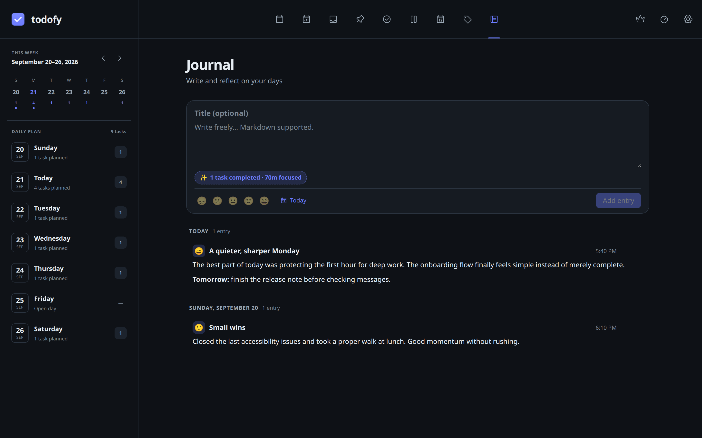
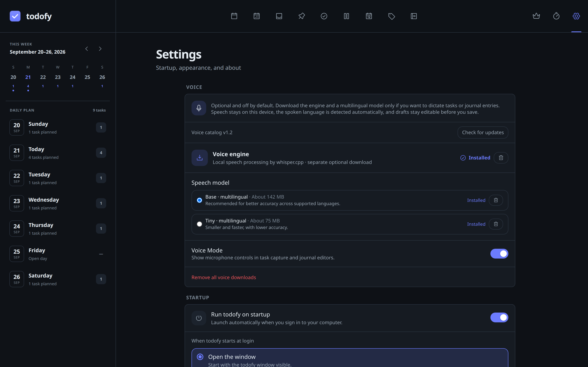
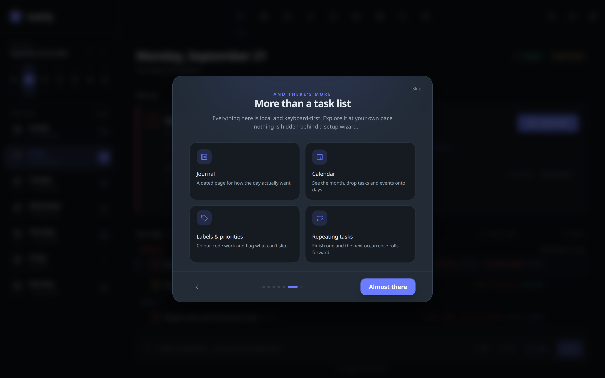
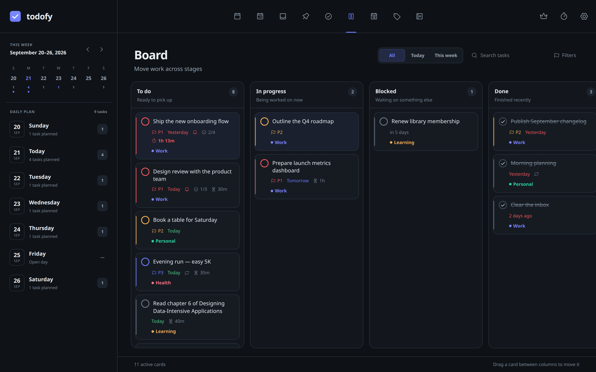
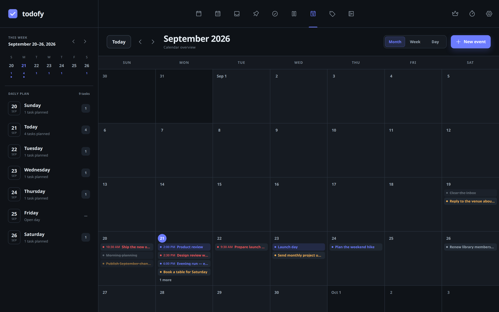
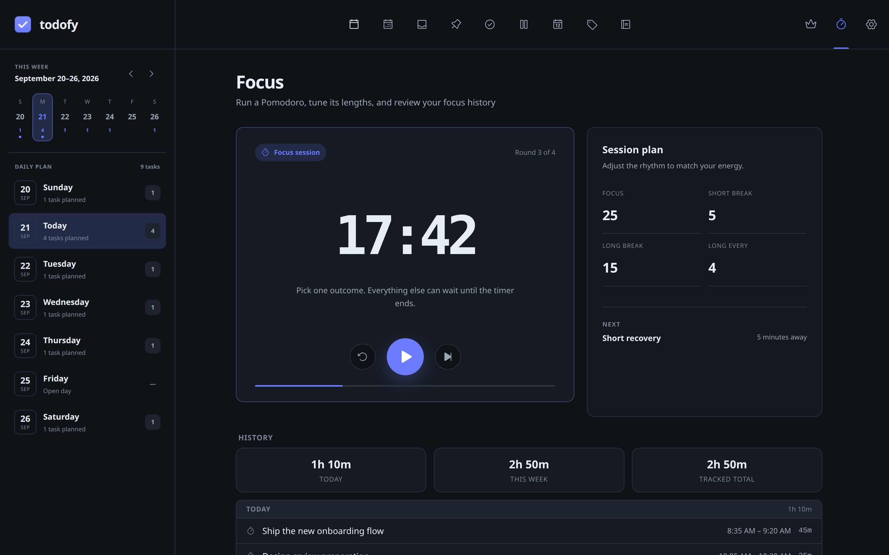
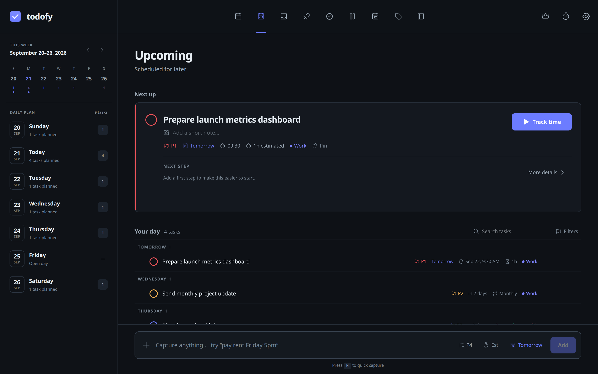
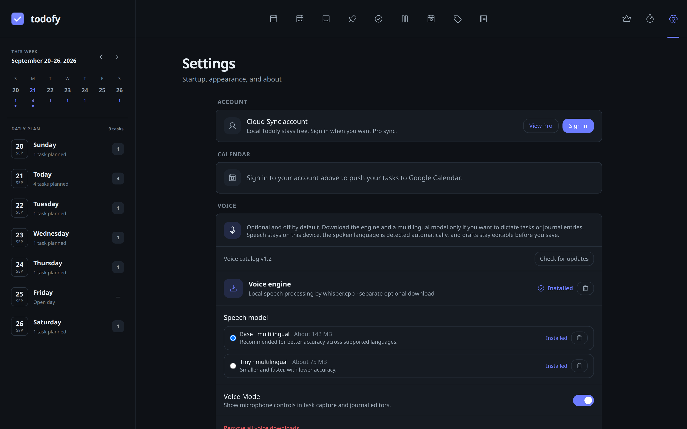
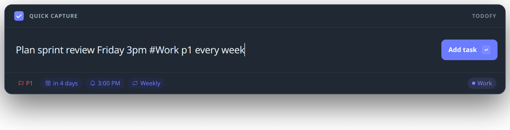

<div align="center">


# todofy

**A modern, fast, and private task and calendar app for Linux, macOS, and Windows.**

Plan your work as a list, a board, or a calendar. Stay focused with timers and reminders, optionally sync across devices, and push dated tasks one‑way to Google Calendar — even when todofy is tucked away in your tray.


<br />



</div>

---

## ✨ Features

- 🗓️ **Smart views** — _Today_ (with overdue rollup), _Upcoming_ (grouped by date), and _Inbox_
- 📋 **Kanban board** — see your work as cards across _To do_, _In progress_, _Blocked_ and _Done_. Drag a card down its column to reorder it or across to change its stage; dropping into _Done_ completes the task properly, so a repeating task still rolls forward to its next occurrence and dragging it back out re‑opens it. Cards carry the same detail as list rows — priority, due date, labels, checklist progress, estimate, and live tracked time — and clicking one opens the full task in a dialog. Narrow the board to _Today_ or _This week_, search and filter as you would anywhere else, or move the selected card with **H** / **L**. The board keeps its own arrangement, so rearranging cards never disturbs your list order
- ⚡ **Global quick‑add** — hit **Ctrl+Alt+A** anywhere (even with todofy tucked in the tray) for a floating capture bar; type, press Enter, and you're back to what you were doing
- ✍️ **Natural‑language quick‑add** — type _"pay rent friday 5pm #home p1"_ and the date, time, priority, and label are parsed out live and shown as chips
- 🎙️ **Optional local voice input** — download the free whisper.cpp engine and a multilingual model in Settings, then enable Voice Mode to dictate a task or journal draft. A live waveform stays inside the editor while you speak. Nothing downloads or requests microphone access until you choose to use it
- 🔁 **Recurring tasks** — repeat _daily, every weekday, weekly, monthly,_ or _yearly_; completing one rolls it forward to the next occurrence instead of finishing it (also from natural language — _"water plants every week"_)
- 🍅 **Focus timers** — a built‑in **Pomodoro** (focus / short & long breaks) _and_ a **per‑task stopwatch** with **start, pause, and stop**, so a break isn't recorded as work; both keep counting while hidden in the tray and survive a restart, and never auto‑stop — they nudge you instead. Choose whether a task's play button is a plain stopwatch or launches a Pomodoro bound to that task
- ⏳ **Estimates vs. actual** — give a task an expected length (**"90"**, **"1h30"**, **"1.5h"** all work), watch its time count up live on the task row, and see it turn **red** with the overrun once it runs past the estimate — in the app and on the tray clock
- 📊 **Focus screen** — start the Pomodoro, tune phase lengths, and review your focus history (Today / This week / total, grouped by day)
- 📔 **Journal** — write free‑form entries with **Markdown**, an optional title, and a 1–5 **mood**; entries group by day, mark journaled days in the calendar rail, and offer a one‑tap summary of what you completed and focused on that day (press **Shift+J** to jump in)
- ✋ **Drag‑and‑drop reordering** — grab any task and drop it exactly where you want; your manual order sticks
- 📌 **Pinning** — pin any task to float it to the top of its group, with a dedicated _Pinboard_ view
- ✅ **Completed view** — every finished task, app-wide, newest first
- ☑️ **Subtasks / checklists** — break a big task into steps with a live progress bar, so it's easier to start and keep momentum
- 🔍 **Search & filters** — narrow any view by title/notes as you type, with filter chips for priority and labels; press `/` to jump to search
- 🧠 **ADHD-friendly touches** — relative due dates (_"in 3 days"_), a completion streak & confetti reward (both optional and motion-safe), and a `?` shortcut cheat-sheet
- 🏷️ **Labels** — create, rename, recolor (with a full custom color picker), and delete; a searchable Labels page plus per-label filtering
- 📆 **Beautiful date & time picker** — click the month or year to jump anywhere in seconds, then set the date, the time, and the recurrence in a single pass without the picker closing on you. The time goes into a themed **HH:MM** field that follows your locale, and the one‑tap quick times are yours to edit
- ⏰ **Reminders that reach you** — desktop notifications fire **even when hidden in the tray**, as either a system notification or todofy's own popup card pinned to a screen corner, with one‑tap **snooze**. Optionally repeat until you actually answer, with a **sound** (built‑in or your own file), a volume, and a ramp that gets louder each time
- 🚩 **Priorities** — P1–P4 with color‑coded flags
- ⬇️ **Signed self‑updates** — todofy checks for a new version quietly once a day and can install it for you. Turn on **Install automatically** and it offers the update as soon as it finds one, shows you what's new, and handles the rest — but it never downloads without asking and never restarts on its own, and a question that arrives while todofy is in the tray waits until you're back at the window. Progress follows you around the app as a ring in the top bar. Every bundle is cryptographically signed and verified before install, so a tampered build is refused; `.deb` and `.rpm` installs are pointed at the release page rather than replaced behind your package manager's back
- ⚙️ **Settings & run‑on‑startup** — launch todofy at login, opening the window or starting quietly in the tray
- 🌍 **Follows your system** — 12‑ or 24‑hour clock and the day your week starts on are taken from your desktop's regional settings, with an explicit override if you'd rather choose
- 🌗 **Light & dark themes** — dark by default, remembers your choice
- ⌨️ **Keyboard‑first** — add, navigate, complete, and edit without touching the mouse
- 🪟 **System tray** — closes to tray and keeps running so reminders never miss; start/pause the Pomodoro, pause or stop the task timer, and watch the live countdown right from the tray
- 🧭 **Date-oriented navigation** — move between smart views from the top navigation bar and use the day rail to jump through your schedule
- ☁️ **Optional account sync** — official Todofy Cloud Sync is a Pro feature at **€3.99/month or €39/year**; local use stays free, and the source-available self-hosting setup remains documented below. Buy securely in Lemon Squeezy before or after creating an account, then return to Todofy, sign in, and activate the emailed license for that account. Sign in with email/password or **Continue with Google** to sync tasks, labels, focus history, and journal across devices (backed by Supabase, with row‑level security). Sessions are kept in your OS secret store. If you switch accounts on one installation, Todofy pauses before syncing and lets you load the new account's cloud data or safely copy the current device data into it with new record IDs
- 🗓️ **Local calendar** — plan in month, week, or day views, with tasks on their due dates and standalone all-day or timed events you can create and edit. Standalone events stay on this device and are not included in account sync or pushed to Google
- 📅 **Google Calendar sync** — push your dated tasks to a dedicated **todofy** calendar (one‑way) so they sit right beside your meetings: all‑day for date‑only tasks, timed for tasks with a reminder. Recurring tasks move as they roll, completed and deleted tasks tidy themselves up, and you can keep finished tasks or limit the push to timed tasks only. Opt‑in, gated behind account sign‑in
- 🗑️ **Delete your account** — cancel any linked recurring Todofy subscription first, then remove your current account and all of its cloud data; optionally wipe the copy on this device too. If cancellation cannot be confirmed, deletion stops safely so you can retry. You can register a fresh account later with the same email address
- 💾 **Local‑first** — everything is stored in a local SQLite database and works fully offline; sync is additive, and with no account there's no cloud and no tracking

### Voice Mode

Voice Mode is free and off by default. Open **Settings → Voice**, download the voice engine and either the recommended multilingual Base model (about 142 MB) or the smaller Tiny model (about 75 MB), then turn on Voice Mode. The spoken language is detected automatically. Click the microphone icon in the task composer, global quick capture, or journal editor. A live waveform opens at the top of that editor; click the stop icon to insert editable text, or **X** to discard the recording. The existing Add or Save button remains a separate step. English scheduling phrases in a dictated task use the same quick-add parser as typed text; other languages stay as editable task text.

The engine and model are stored outside the app bundle and can be removed in Settings. Downloads are verified against a signed catalog. Recording and transcription stay on your device; the temporary audio file is removed after transcription or cancellation. Saved task or journal text follows your existing local storage and optional account sync settings. The voice engine is [whisper.cpp](https://github.com/ggml-org/whisper.cpp) and the GGML speech models come from the [whisper.cpp model collection](https://huggingface.co/ggerganov/whisper.cpp). Their license notices are in [third party notices](docs/third_party/) and attached to the release.

To test voice input from source with local engine and model files, follow [local voice testing](docs/local-voice-testing.md).

## 📸 Screenshots

<table>
  <tr>
    <td colspan="2">
      <br />
      <sub><b>Journal</b> — a Markdown composer with mood and a day‑summary nudge, entries grouped by day with journaled days marked in the calendar rail.</sub>
    </td>
  </tr>
  <tr>
    <td width="50%">
      <br />
      <sub><b>Local voice</b> — private on-device dictation with whisper.cpp, downloadable multilingual models, and editable transcripts.</sub>
    </td>
    <td width="50%">
      <br />
      <sub><b>Welcome tour</b> — a polished first run through capture, focus, reminders, and the wider workspace.</sub>
    </td>
  </tr>
  <tr>
    <td width="50%">
      <br />
      <sub><b>Board</b> — move work from idea to done without losing task context.</sub>
    </td>
    <td width="50%">
      <br />
      <sub><b>Calendar</b> — see tasks, reminders, and events together across the month.</sub>
    </td>
  </tr>
  <tr>
    <td width="50%">
      <br />
      <sub><b>Focus workspace</b> — one calm timer, a flexible session plan, and progress history.</sub>
    </td>
    <td width="50%">
      <br />
      <sub><b>Upcoming</b> — a clear next action with future work grouped by day.</sub>
    </td>
  </tr>
  <tr>
    <td width="50%">
      <br />
      <sub><b>Settings</b> — cloud sync, calendar, and private on-device voice controls in one place.</sub>
    </td>
    <td width="50%">
      <br />
      <sub><b>Quick capture</b> — add a task from anywhere without leaving your flow.</sub>
    </td>
  </tr>
</table>

## ☁️ Todofy Pro

Todofy stays fully useful offline without an account. **Todofy Pro** adds official
Cloud Sync for **€3.99/month or €39/year**, covering tasks, labels, focus history,
and journal entries across your signed-in devices.

Open **Pro** inside Todofy to choose a plan, complete checkout securely in your
browser, then return to the app and activate the license from your receipt. An
existing Lemon Squeezy license can be activated after signing in. Subscription
status is verified by Todofy's billing service and enforced again by the hosted
database; cancelling keeps access only through the paid-through date. Account
deletion first cancels a linked recurring subscription and stops safely if that
cancellation cannot be confirmed.

Cancel anytime, with a full refund within 14 days of any charge. See the
[Terms of Service](https://unifybrowse.com/products/todofy/terms) and
[Privacy Policy](https://unifybrowse.com/products/todofy/privacy).

## 📦 Install

Grab a package from the [Releases](../../releases) page, or build it yourself (see below).

**AppImage** — portable, runs on any distro:

```bash
chmod +x todofy_1.13.0_amd64.AppImage
./todofy_1.13.0_amd64.AppImage
```

**Debian / Ubuntu:**

```bash
sudo dpkg -i todofy_1.13.0_amd64.deb
```

**Fedora / RHEL / openSUSE:**

```bash
sudo rpm -i todofy-1.13.0-1.x86_64.rpm
```

**macOS** — open the `.dmg` and drag todofy into Applications. It's not
notarized yet, so on first launch right‑click the app and choose **Open** to
get past Gatekeeper:

```
todofy_1.13.0_universal.dmg  # Intel and Apple Silicon
```

**Windows** — run the installer:

```
todofy_1.13.0_x64-setup.exe   # NSIS installer
todofy_1.13.0_x64_en-US.msi   # or the MSI
```

> Your tasks live in the app's data directory — `~/.local/share/com.unifybrowse.todofy/`
> on Linux, `~/Library/Application Support/com.unifybrowse.todofy/` on macOS, and
> `%APPDATA%\com.unifybrowse.todofy\` on Windows.

### Staying up to date

todofy looks for a new version quietly once a day and tells you when it finds
one. **Settings → Updates** is where this lives:

| Setting                   | What it does                                                                          |
| ------------------------- | ------------------------------------------------------------------------------------- |
| **Check automatically**   | The daily look. Turn it off and todofy only checks when you press **Check now**       |
| **Install automatically** | Offers each new version as soon as it's found, then downloads and installs on your OK |

Neither one takes the decision away from you: todofy always asks before
downloading and never restarts on its own, so an update can't interrupt a
half‑typed task. If the question arrives while todofy is in the tray it waits
until the window is back on screen. Downloads show their progress as a ring in
the top bar, from any view.

Every bundle is cryptographically signed at release time and verified before it
is installed, so an unofficial or tampered build is refused. The AppImage,
macOS and Windows builds update in place; **`.deb` and `.rpm` installs are owned
by your package manager**, so todofy points those at the release page instead of
replacing files behind your package database's back.

## ⌨️ Keyboard shortcuts

| Key                    | Action                                                       |
| ---------------------- | ------------------------------------------------------------ |
| `Ctrl`+`Alt`+`A`       | Open the global quick‑add bar from anywhere (works app‑wide) |
| `n`                    | New task — or a new journal entry when in the Journal        |
| `Shift`+`J`            | Open the Journal and start a new entry                       |
| `/`                    | Focus the search bar                                         |
| `j` / `↓`              | Move to next task                                            |
| `k` / `↑`              | Move to previous task                                        |
| `h` / `←`              | Board: move the selected card one column left                |
| `l` / `→`              | Board: move the selected card one column right               |
| `e`                    | Edit the selected task                                       |
| `c` / `Enter`          | Complete / uncomplete the selected task                      |
| `p`                    | Pin / unpin the selected task                                |
| `Backspace` / `Delete` | Delete the selected task                                     |
| `?`                    | Show the keyboard shortcuts cheat-sheet                      |
| `Esc`                  | Close the detail panel / picker / cheat-sheet                |

## 🛠️ Build from source

### Prerequisites

- [Rust](https://rustup.rs/) (stable)
- [Bun](https://bun.sh/)
- System libraries for Tauri on Linux:

```bash
# Debian / Ubuntu
sudo apt update
sudo apt install libwebkit2gtk-4.1-dev build-essential curl wget file \
  libxdo-dev libssl-dev libayatana-appindicator3-dev librsvg2-dev \
  libasound2-dev
```

### Develop

```bash
bun install
bun run tauri dev
```

### Build release bundles

```bash
bun run tauri build
```

Bundles are written to `src-tauri/target/release/bundle/` (`.deb`, `.rpm`, and `.AppImage`).

Release builds also produce signed updater artifacts, so the build needs the updater's private key in the environment — `.env` files are not read for this:

```bash
export TAURI_SIGNING_PRIVATE_KEY="$(cat ~/.tauri/todofy-updater.key)"
export TAURI_SIGNING_PRIVATE_KEY_PASSWORD=""
```

Official releases are signed in CI from the `TAURI_SIGNING_PRIVATE_KEY` repository secret. To build unsigned bundles for yourself, generate your own keypair with `bunx tauri signer generate -w ~/.tauri/todofy-updater.key` and put the matching public key in `plugins.updater.pubkey` — the in-app updater only installs bundles signed by the key it was built with, so an unofficial build cannot be updated from the official releases.

### Optional: self‑host account sync

Sync is **off by default** — todofy is local‑first and works fully offline without it. To run your own sync backend so your tasks, labels, focus history, and journal follow you across devices (with nothing going through anyone else's server):

1. **Create a Supabase project** — the free tier is plenty — at [supabase.com](https://supabase.com), or use any Postgres you control. Make sure **Email** auth is enabled (it is by default).
2. **Apply the schema.** Open the project's **SQL Editor** and run every file in [`supabase/migrations/`](supabase/migrations) in filename order:

   | #   | Migration                                                                                      | Adds                                                         |
   | --- | ---------------------------------------------------------------------------------------------- | ------------------------------------------------------------ |
   | 1   | [`20260826120000_sync_schema.sql`](supabase/migrations/20260826120000_sync_schema.sql)         | The per‑user content tables, indexes, and row‑level security |
   | 2   | [`20260902000000_journal.sql`](supabase/migrations/20260902000000_journal.sql)                 | Journal entries                                              |
   | 3   | [`20260902133603_sync_tombstones.sql`](supabase/migrations/20260902133603_sync_tombstones.sql) | The content‑free deletion log                                |
   | 4   | [`20260909120000_task_estimate.sql`](supabase/migrations/20260909120000_task_estimate.sql)     | `tasks.estimate_minutes`                                     |
   | 5   | [`20260914120000_sync_pull.sql`](supabase/migrations/20260914120000_sync_pull.sql)             | The `sync_pull` function, one request per poll               |
   | 6   | [`20260918120000_task_board.sql`](supabase/migrations/20260918120000_task_board.sql)           | `tasks.stage` and `tasks.board_index` for the board          |

   Every migration is additive and idempotent, so re‑running one is safe and an older client keeps working against a newer schema. Applying them all matters: the desktop app writes every column it knows about, so a missing one fails the whole sync rather than just its own feature.

   Or use the [Supabase CLI](https://supabase.com/docs/guides/cli):

   ```bash
   supabase link --project-ref <your-project-ref>
   supabase db push
   ```

   Everything lands in the default `public` schema: five per‑user content tables plus the content-free `sync_tombstones` deletion log. All of them use row-level security, so signed-in users can only access their own rows. Deleted content is physically removed after its marker is safely recorded, allowing other devices to learn the deletion without retaining task or journal text.

3. **Point todofy at your project.** Copy the env template and fill in your project's URL and publishable key — both are safe to ship in a client; row‑level security is what actually protects the data:

   ```bash
   cp .env.example .env
   # VITE_SUPABASE_URL=https://<your-project-ref>.supabase.co
   # VITE_SUPABASE_PUBLISHABLE_KEY=<your-publishable-key>
   ```

   Supabase requests go through Tauri's native HTTP transport, which only reaches
   hosts listed in [`capabilities/default.json`](src-tauri/capabilities/default.json).
   A hosted `*.supabase.co` project and a local `supabase start` stack both work as
   shipped. If you run Supabase on **your own domain**, add it to the `http:default`
   allow list before building, or every request is denied and sync silently stops:

   ```jsonc
   {
     "identifier": "http:default",
     "allow": [
       { "url": "https://*.supabase.co/*" },
       { "url": "https://supabase.example.com/*" }, // ← your host
     ],
   }
   ```

4. **Deploy the account-deletion function.** So users can delete their own account (which can't be done with the client key), deploy the [`delete-account`](supabase/functions/delete-account/index.ts) edge function. It verifies the caller and deletes their auth user; the schema's `on delete cascade` removes all their data:

   ```bash
   supabase functions deploy delete-account
   supabase secrets set TODOFY_BILLING_REQUIRED=false
   ```

   The edge runtime provides the service-role key automatically. The explicit
   `TODOFY_BILLING_REQUIRED=false` setting declares that this self-hosted project
   has no Todofy recurring billing to cancel.

5. **(Optional) Enable Google sign-in.** In the [Google Cloud Console](https://console.cloud.google.com), create an OAuth client of type **Web application** and add your Supabase callback (`https://<your-project-ref>.supabase.co/auth/v1/callback`) as an authorized redirect URI. Paste the client ID and secret into **Supabase → Authentication → Providers → Google**, then add the exact URL `http://127.0.0.1:3369/auth-callback` under **Supabase → Authentication → URL Configuration → Redirect URLs**. Do not add this loopback URL to the Google Cloud OAuth client; Google redirects to Supabase, and Supabase redirects back to Todofy. Todofy starts the local listener before opening the system browser, completes the PKCE code exchange, and then shows a success or error page with a **Back to Todofy** button. Port `3369` must be available while sign-in is running.

6. **(Optional) Enable Google Calendar sync.** In the [Google Cloud Console](https://console.cloud.google.com), enable the **Google Calendar API** and create a second OAuth client of type **Desktop app**. Add its client ID and secret to your `.env`:

   ```bash
   # VITE_GOOGLE_CLIENT_ID=<your-desktop-client-id>
   # VITE_GOOGLE_CLIENT_SECRET=<your-desktop-client-secret>
   ```

   The desktop flow returns through a loopback redirect (`http://127.0.0.1`) with PKCE — no deep link needed here. todofy writes only to a dedicated **todofy** calendar it creates, using the narrow `calendar.app.created` scope, so it never touches your other calendars. The client secret is embedded per Google's installed‑app flow and is not treated as confidential. Connect it from **Settings → Calendar** (requires a signed‑in account).

7. **Build** as above, then open **Settings → Account** in the app and sign up — sync turns on from there.

### Regenerate the app icon

```bash
bunx tauri icon app-icon.svg
```

## 🧱 Tech stack

| Layer   | Choice                                                                |
| ------- | --------------------------------------------------------------------- |
| Shell   | [Tauri 2](https://tauri.app) (Rust)                                   |
| UI      | [Preact](https://preactjs.com) + TypeScript                           |
| Styling | [Tailwind CSS 4](https://tailwindcss.com) with a custom design system |
| State   | [Zustand](https://github.com/pmndrs/zustand)                          |
| Storage | SQLite via [rusqlite](https://github.com/rusqlite/rusqlite)           |
| Sync    | [Supabase](https://supabase.com) (Postgres + Auth), optional          |
| Build   | [Vite](https://vite.dev) + [Bun](https://bun.sh)                      |

## 📁 Project structure

```
todofy/
├── src/                    # Preact frontend
│   ├── components/         # UI (Sidebar, TaskList, TaskDetail, DatePicker,
│   │                       #     BoardView, CalendarView, FocusView,
│   │                       #     JournalView, SettingsView, …)
│   ├── lib/                # dates, duration, locale, sound, tracking, theme,
│   │                       #     keyboard, nlp, repeat, markdown, journal,
│   │                       #     board columns, ordering, drag helpers
│   ├── store.ts            # Zustand store
│   └── types.ts
├── src-tauri/              # Rust backend
│   └── src/
│       ├── commands.rs     # task & label CRUD (Tauri commands)
│       ├── db.rs           # SQLite schema & migrations
│       ├── recur.rs        # recurring-task date math
│       ├── timer.rs        # focus timers (Pomodoro + per-task stopwatch)
│       ├── settings.rs     # app settings & run-on-startup
│       ├── scheduler.rs    # background reminders + timer nudges
│       ├── notify.rs       # notification delivery (portal / native)
│       ├── popup.rs        # custom corner notification window
│       ├── tray.rs         # system tray + live timer controls
│       ├── sync.rs         # account-sync merge (push/pull, last-write-wins)
│       ├── auth_oauth.rs    # Supabase Google sign-in loopback callback (PKCE)
│       ├── google_calendar.rs # Google OAuth loopback listener (desktop PKCE)
│       ├── calendar.rs     # one-way Google Calendar task-push diff + poll thread
│       ├── secret.rs       # OS keychain access for the session
│       └── lib.rs          # app setup
└── app-icon.svg            # source for the app icon
```

## 🗺️ Roadmap

- [x] Drag‑and‑drop reordering
- [x] Natural‑language quick‑add (_"pay rent friday 5pm"_)
- [x] Recurring tasks
- [x] Focus timers (Pomodoro + per‑task time tracking)
- [x] Run on startup
- [x] Subtasks & checklists
- [x] Search & filters
- [x] Optional account sync across devices
- [x] Journal with mood, Markdown, and day summaries
- [x] Local calendar with month, week, and day views
- [x] Google Calendar sync (one‑way push)
- [x] Task estimates with elapsed-vs-estimate tracking
- [x] System clock and calendar conventions (12/24h, week start)
- [x] Repeating reminders with sound, volume, and ramp-up
- [x] Kanban board with drag between columns
- [ ] Custom board columns (rename, recolor, reorder, and WIP limits)
- [ ] Priority profiles (per-priority names, colors, sounds, and notification styles)

## 🤝 Contributing

Contributions are welcome — open an issue to report a bug or share an idea, or
send a pull request. todofy is owned and maintained by Salar Zeidanlou; by
contributing you agree that your changes are licensed to the project as
described in the [LICENSE](LICENSE).

## 📄 License

© 2026 Salar Zeidanlou. All rights reserved.

Source-available: you may view the code and contribute to it, but it may not be
used, copied, or redistributed on its own without prior written permission. See
the [LICENSE](LICENSE) for the full terms.

## Star History

<a href="https://www.star-history.com/?repos=salarzeidanlou%2Ftodofy&type=date&logscale=&legend=top-left">
 <picture>
   <source media="(prefers-color-scheme: dark)" srcset="https://api.star-history.com/chart?repos=salarzeidanlou/todofy&type=date&theme=dark&logscale&legend=top-left&sealed_token=0Cn2nzTB3h-9RgX6PWZvpuO764C-D8R1Z38Z-x3C30atIwGeGFC1hXz1WQ0gMmYmZr5bTOz4dHTDKjH125TE3U4rvFE8I09_iqo_6xTrUTVLcKvK7bw4tw31btK-h51gNQzlM2VTvWRMsb4VTHpYwVxNe8l2sn6eP9NI8LuwjMUGFnT3AH2pHt9XhcBa" />
   <source media="(prefers-color-scheme: light)" srcset="https://api.star-history.com/chart?repos=salarzeidanlou/todofy&type=date&logscale&legend=top-left&sealed_token=0Cn2nzTB3h-9RgX6PWZvpuO764C-D8R1Z38Z-x3C30atIwGeGFC1hXz1WQ0gMmYmZr5bTOz4dHTDKjH125TE3U4rvFE8I09_iqo_6xTrUTVLcKvK7bw4tw31btK-h51gNQzlM2VTvWRMsb4VTHpYwVxNe8l2sn6eP9NI8LuwjMUGFnT3AH2pHt9XhcBa" />
   
 </picture>
</a>

---

<div align="center">
Made with ❤️ and Rust for Linux, macOS, and Windows.
</div>
